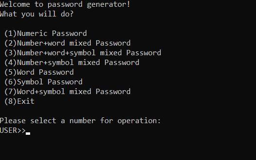

# BasicPasswordGenerator
Open source script, written in Python, that randomly generates long and fast passwords.
 

<H2>"etc/" files details:</H2>
<ol>
  <li><H3>clear.py:Clears the console</H3></li>
  <li><H3>N.py:Numeric Password Generator</H3></li>
  <li><H3>NS.py:Numberc+Symbol mixed Password</H3></li>
  <li><H3>NW.py:Number+Word mixed Password</H3></li>
  <li><H3>NWS.py:Number+Word+Symbol mixed Password</H3></li>
  <li><H3>S.py:Symbol Password</H3></li>
  <li><H3>W.py:Word Password</H3></li>
  <li><H3>WS.py:Word+Symbol mixed Password</H3></li>
</ol>
